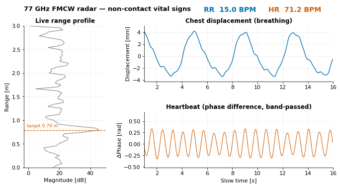
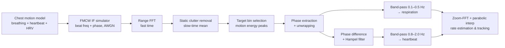
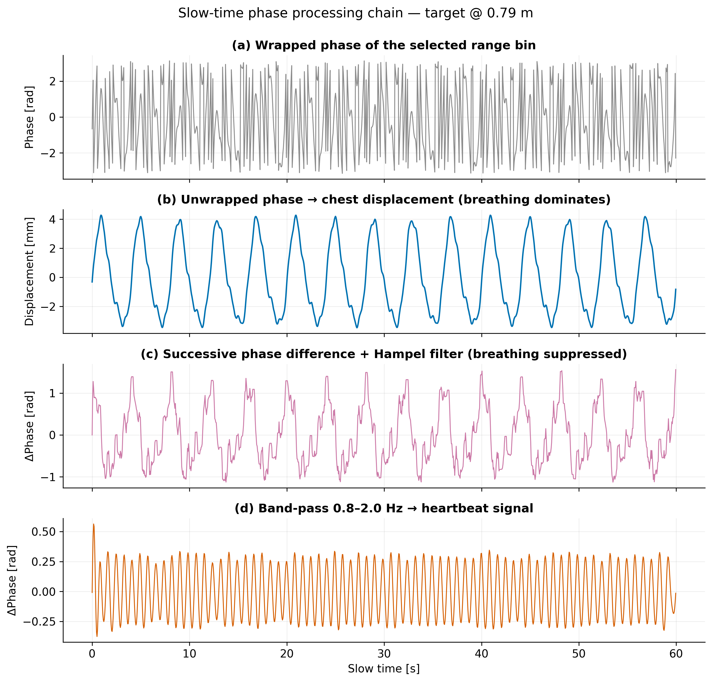
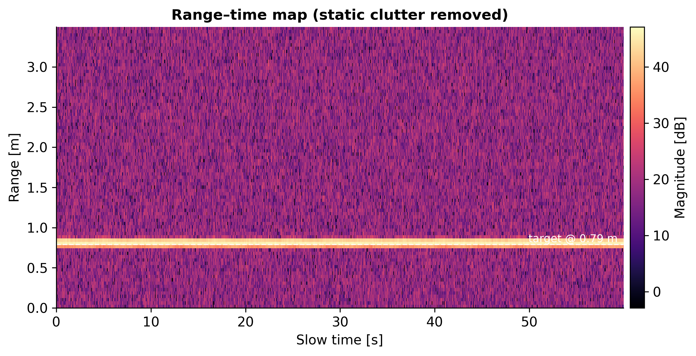
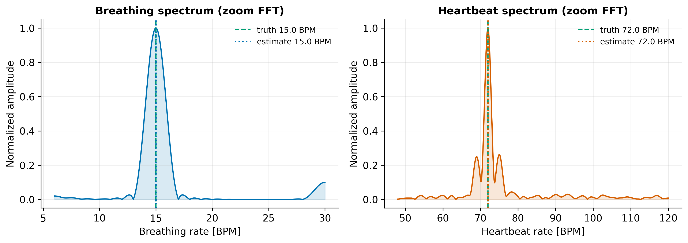
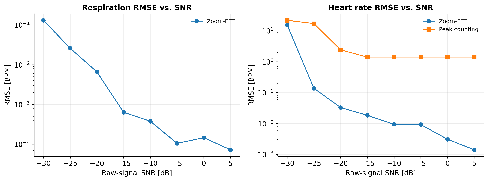

# FMCW Radar Vital Signs Monitoring

**Non-contact respiration & heart-rate estimation from a simulated 77 GHz FMCW radar — a fully reproducible DSP pipeline.**




Breathing moves the chest by a few millimetres, a heartbeat by a few hundred micrometres.
At 77 GHz (λ ≈ 3.9 mm) these motions are far too small to shift a target between range bins —
but they are *amplified* in the phase of the received signal:

$$\phi(t) = \frac{4\pi}{\lambda}\, R(t) \quad\Rightarrow\quad \Delta\phi = \frac{4\pi}{\lambda}\,\Delta d$$

A 0.35 mm heartbeat displacement becomes a ≈ 1.1 rad phase swing.
This repository turns that idea into a complete, tested signal-processing chain,
following *Vital Signs Monitoring of Multiple People using a FMCW Millimeter-Wave Sensor* (Ahmad et al., TI).

Everything runs on a **physics-based simulator** (chirp-level IF synthesis from a chest-displacement
model), so ground truth is known exactly and every figure below is reproducible with one command —
no radar hardware required.

## Pipeline



## Results

### From wrapped phase to heartbeat

The core of phase-based sensing in one figure: the raw wrapped phase (a) unwraps into the
chest-displacement waveform where breathing dominates (b); successive phase differencing
suppresses the breathing component (c); band-pass filtering isolates a clean heartbeat signal (d).



### Spatial isolation and rate estimation

| Range–time map | Rate spectra |
|---|---|
|  |  |

At 0 dB raw SNR the estimates land within **0.1 BPM** of the ground truth
(RR 15.0 / HR 72.0 BPM). The multi-person scenario separates two subjects at
0.8 m and 1.5 m and recovers both sets of vitals independently — see
[`results/figures/multi_person/`](results/figures/multi_person).

### Robustness: Monte-Carlo SNR sweep

Zoom-FFT spectral estimation stays below 0.2 BPM RMSE down to −25 dB raw SNR
(the range FFT contributes ~24 dB of coherent gain); time-domain peak counting
degrades much earlier — a concrete argument for frequency-domain estimation.



## Quickstart

```bash
git clone https://github.com/<you>/fmcw-vital-signs.git
cd fmcw-vital-signs
pip install -e .[dev]

python scripts/run_pipeline.py                        # single-person scenario + figures
python scripts/run_pipeline.py --scenario multi_person
python scripts/run_snr_sweep.py                       # Monte-Carlo robustness study
python scripts/make_figures.py                        # regenerate everything
python scripts/make_gif.py                            # rebuild the demo GIF above
pytest                                                # verify rate recovery end-to-end
```

Radar parameters (77 GHz, 3.6 GHz sweep → 4.2 cm range resolution, 20 Hz slow-time rate)
and scenario definitions (target ranges, vital rates, SNR) live in [`configs/`](configs) —
add a YAML file to create your own scenario.

## Repository structure

```
src/fmcw_vitals/
├── simulate/      chest displacement model, chirp-level IF signal synthesis
├── processing/    range FFT, clutter removal, bin selection, phase ops, filters
├── estimation/    zoom-FFT spectral estimator, peak counting, sliding-window tracker
├── evaluation/    BPM error metrics
└── viz/           one consistent publication style + all figure functions
configs/           radar parameters & scenario YAMLs
scripts/           run_pipeline / run_snr_sweep / make_figures
tests/             end-to-end rate-recovery tests
```

## Roadmap

- [ ] Random body-motion artifacts and motion-robust estimation
- [ ] Breathing-harmonic interference analysis (harmonics vs. true heartbeat peak)
- [ ] Real-data loader (TI DCA1000 `.bin`; public dataset of Schellenberger et al., 2020)
- [x] Animated real-time demo GIF
- [ ] Comparison with camera-based rPPG (Green / ICA / POS)

## References

1. S. Ahmad et al., *Vital Signs Monitoring of Multiple People using a FMCW Millimeter-Wave Sensor*, IEEE Radar Conference, 2018.
2. M. Alizadeh et al., *Remote Monitoring of Human Vital Signs Using mm-Wave FMCW Radar*, IEEE Access, 2019.
3. S. Schellenberger et al., *A dataset of clinically recorded radar vital signs with synchronised reference sensor signals*, Scientific Data, 2020.
